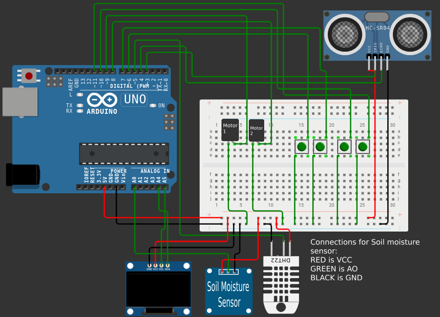

# FARMING++, farming made easy
Farming++ is a project made by Manas Jawale and my friend Vignesh, we aim to make farming easier than it used to be. This project utilizes the power of the latest Arduino (Arduino UNO Q) and several sensors to help our farmers get the note of every important detail around themself.

## About
Farming++ is a project made with aim to making farming easier using robotics and AI. Since many years, many farmers struggled both financially and mentally because one time their crops will wilt and one time it will die out due to immense rain.
 
With the use of this such technologies, farmers can inspect how good soil is, what is the weather, etc.

## Prequisties
In order to use this in your own circuit, first follow the following steps:
1. Copy the git HTTPs URL of this repository
2. Clone this repo using `git clone <repository-link>`
3. Create a venv in the repository folder using `python -m venv .venv`
4. Activate the venv using:
    * `source .venv/bin/activate` if you are using bash
    * `.venv\Scripts\activate.bat` for command prompt 
    * `.venv\Scripts\activate.ps1` for powershell.
5. Install the dependencies using `pip install -r requirements.txt`, this installs all the required python dependencies needed.

Along with that, you would also need to give a Google gemini API key to the program, so remember to have an API key in your [google AI studio](https://aistudio.google.com).

## Setup
In order to make the circuit yourself, follow the given steps:
1. Make the following circuit: (We recommend to use Capacitive Soil Sensor)

2. Open ArduinoController in arduino IDE and upload `ArduinoController.ino` .
3. Run the [Transcriber](/Transcriber.py)
4. Enter your API key
5. Keep the app running
6. Start your arduino alongside
